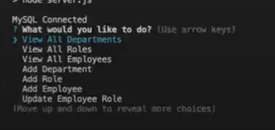

# Employee Tracker

## Badges

## Description
This application is an Employee Management System that allows a user to manage departments, roles, and employees in a company. The application uses a MySQL database to store the information and is built using Node.js, Inquirer, and MySQL2.

## Table of Contents
- [Installation](#installation)
- [Usage](#usage)
- [Tests](#tests)
- [Questions](#questions)
- [Contributing](#contributing)
- [Credits](#credits)
- [License](#license)

## Installation
1. Requires Node.js. https://nodejs.org/en/ 
2. Requires npm. https://docs.npmjs.com/downloading-and-installing-node-js-and-npm#using-a-node-installer-to-install-nodejs-and-npm 
3. Requires a MySQL account. https://www.mysql.com/
4. Clone or download zipfile of Repo to your device

## Usage
* To start using the application, use mySQL Workbench to setup the database using this file

    [scheme.sql](./schema.sql)

* The application is invoked by running `npm start` in the command line.When you run the application, you will be presented with a menu of options:

1. View All Departments
2. View All Roles
3. View All Employees
4. Add a Department
5. Add a Role
6. Add an Employee
7. Update an Employee Role
8. Exit

* Follow the prompts to finish application. Selecting an option will take you to the corresponding functionality of the application.

  

* [Video Demo](https://drive.google.com/file/d/1EX5khPwEd0p7yEnN7F26mufVfvFOdbzE/view)

* Website
  * [Github](https://github.com/alimomin7861/employee-tracker)

## Features

* JavaScript
* Node.js
* MySQL
* npm packages
  * Inquirer
  * mysql
  * console.table

## Tests
N/A

## Questions
Questions can be directed to this GitHub profile or this email.

GitHub: [alimomin7861](https://github.com/alimomin7861)

Email: [alimomin7861@gmail.com](mailto:alimomin7861@gmail.com)

## Contributing
N/A

## Credits
This application was built using Node.js, Inquirer, and MySQL2.

## License
MIT License

Copyright (c) 2023 Ali Momin